

<!-- _class: cover-->

# Smart Parking Space Assignment using Motion Planning 

**Presenter**: Haohua Li 
**Supervisor**: Akansel Cosgun

---
<!-- _class: cover-->
# Background & Motivation 

---
# Background & Motivation 

Finding a parking space can be a nightmare

> On average Australians will spend 3120 hours on searching for parking spaces in their lifetime according to a study from Parkhound 

### What if 
- AI can take over the tedious parking tasks 

<!-- footer: Australian drivers spend over 3,000 hours looking for parking in their lifetime https://www.parkhound.com.au/blog/australian-drivers-spend-over-3000-hours-looking-for-parking-in-their-lifetime/-->

---
# Background & Motivation 

## Automated Valet Parking
Leave cars at entrance, and self-park. 
Retrieve cars at the exit. 

- **Solution 1**: Self-driving Cars Search Parking Spaces
- **Solution 2**: Smart Parking Lot Assigns Parking Spaces 

<!-- footer: Bosch and Daimler Automated Valet Parking Demo https://www.youtube.com/watch?v=0q-kLX5ISZA-->

---
# Background & Motivation 
## Solution 1 : Self-driving Cars Search Parking Spaces 

<video width="720" src="./nvidia_automated_parking.mp4" autoplay loop></video> 
ParkNet Deep Neural Network (Nvidia, 2019)
<!-- footer: Searching for a Parking Spot? AI Got It  https://blogs.nvidia.com/blog/2019/09/11/drive-labs-ai-parking/-->

---

# Background & Motivation 
## Solution 2 : Smart Parking Lot Assigns Parking Spaces 

<!-- footer: Automated Valet Parking Bosch https://www.bosch-mobility-solutions.com/en/solutions/parking/automated-valet-parking/ -->

---
<!-- _class: cover-->
# Project Aims & Problems 

<!-- footer: . -->
---
# Project Aims & Problems 
While tons of literature focus on Solution 1, 
**Solution 2 has not yet been studied extensively**. 
We decided to investigate **Solution 2**

There are two sub-problems: 
- **Goal Assignment Algorithms** 
  - Find and assign parking spaces to incoming cars 
- **Reference Path** using Motion Planning 
  - Provide a reference path to guide drivers/self-driving cars

---
# Assumptions

To simplify the problem, 
- each vehicle starts at a **random location**
- all parking spaces are **NOT occupied** (occupancy rate is 0). 
- parking lot does **NOT have access to future movements** of all vehicles.  

<!-- footer: . -->

---
# Example Problem 1 (and Solution)
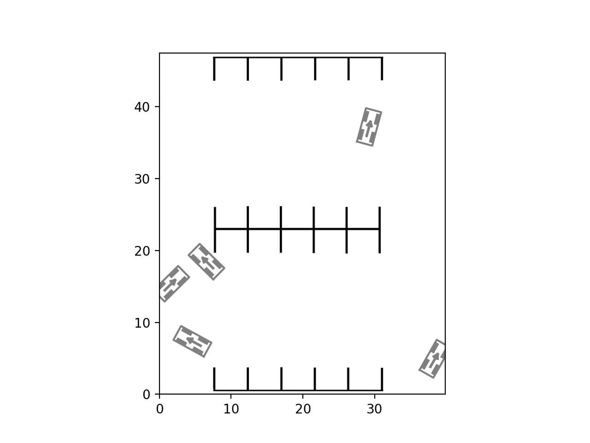
  
 

---
# Example Problem 2 (and Solution)

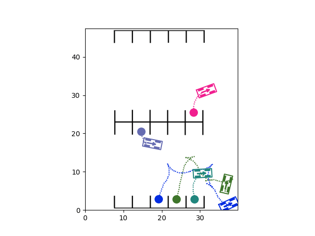

---
# Example Problem 3 (and Solution)

  

---
# Summary of the Project 
#### Goal Assignment Algorithms 
We developed two Euclidean distance based parking spaces algorithms  
- Best First Search (Greedy)
- Brute Force Search (Prioritized)
#### Motion Planning Simulation 
We used RRT* with Reeds Shepp Curve implemented by OMPL to simulate and evaluate our goal assignment algorithms. The results show that 
- **Best First Search** has **higher success rate** (find out a collision-free solution)
- **Brute Force** can achieve **global optima** but **lower success rate**

**First investigation** of parking problem under the kinematic constraints in multi-vehicle scenarios.

--- 

<!-- _class: cover-->
# Approaches 

---  
# Goal Assignment Problem
How to efficiently **assign empty parking spaces** to incoming vehicles?

- **Random**    
- **Greedy**: Best First Search
- **Prioritized**: Brute Force Search

---
# Distance Metric Heuristic
How to measure the **distance** between the agent and a goal? 
- the **orientation** of the vehicle does matter. 
- weight distance for Special Euclidean Group $SE(2)$ !
- **Euclidean** distance and weighted **angular** difference 

$$
d = \sqrt{(x_1-x_2)^2 + (y_1 - y_2)^2 + w_0(\theta_1 - \theta_2)^2}
$$

- $w_0 = 2.6$ , which is determined empirically. 
- **Pros**: easy 
- **Cons**: hyper-paramter tunning for $w_0$ 

<!-- footer: Planning Algorithms by Steven M. LaValle. Available in (5.1.2 Important Metric Spaces for Motion Planning http://planning.cs.uiuc.edu/node188.html)-->

---
# Random Goal Assignment 
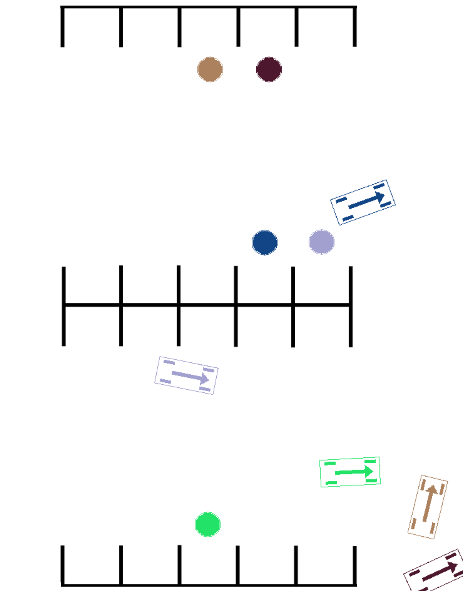

- randomly assign a goal to each agent in the parking lot

<!-- footer: . -->
--- 
# Greedy Goal Assignment 

- **Best First Search**
  - each agent takes the closest parking space 
  - **Heuristic Function**: weighted Euclidean distance
- **Pros**: quickly return a solution 
- **Cons**: not global optimal

<!-- footer: . -->

--- 
# Prioritized Goal Assignment 
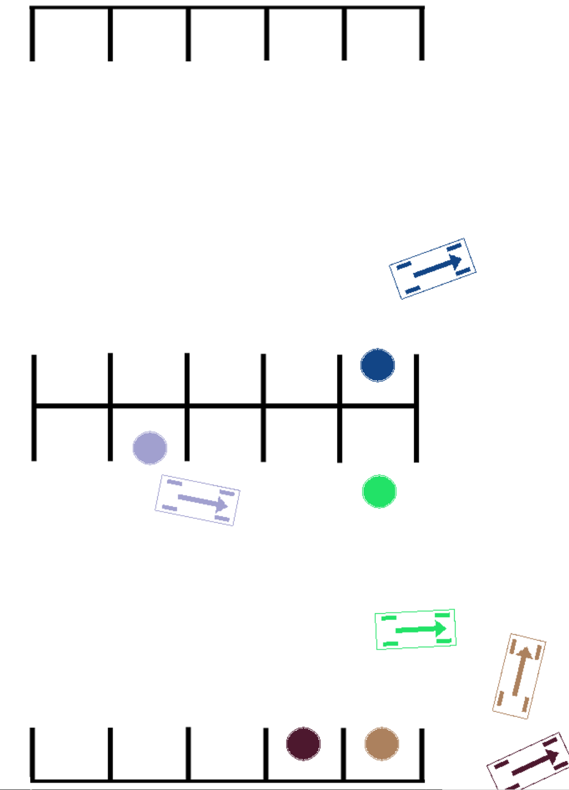

- **Brute Force Search** 
  - each agent has a unique priority 
  - assign spaces based on priorities
  - search all permutations of priorities 
  - **Heuristic Function**: weighted Euclidean distance
- **Pros**: global optimal
- **Cons**: testing a lot of sequences of priorities is time-consuming 

---
# Motion Planning 

> Find a solution to the problem of “**Go** from the **start** to the **goal** while respecting all of the robot’s constraints." 
>  
> --- *OMPL Primer* 

- **Kinematic Model** : 
  - Reeds Shepp Curve (Reeds et al,1990)
- **Motion Planner**: 
  - RRT* (Karaman et al,2011)
- **Conflicts Resolution**

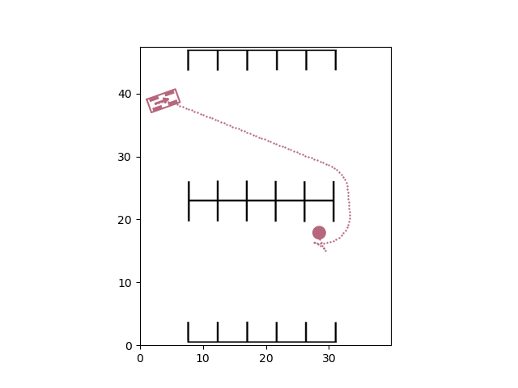

<!-- footer: Open Motion Planning Library A Primer https://ompl.kavrakilab.org/OMPL_Primer.pdf-->

--- 
# Reeds Shepp Curve (Reeds et al,1990)
The kinematic constriants 
$$
\dot{x} = v \cos{\theta} \\
\dot{y} = v \sin{\theta} \\ 
\dot{\theta} = \frac{v}{L}\tan{\phi}
$$
The $x,y$ are in 2D plane,  $\theta$ is the orientation and $L$ is wheel base.   
The control inputs **velocity** $v \in \{-1, 1\}$ and **steering angle** $\phi \in \{-\frac{\pi}{6}, 0, \frac{\pi}{6}\}$. 
Vehicle in **full speed or steering angle**. 
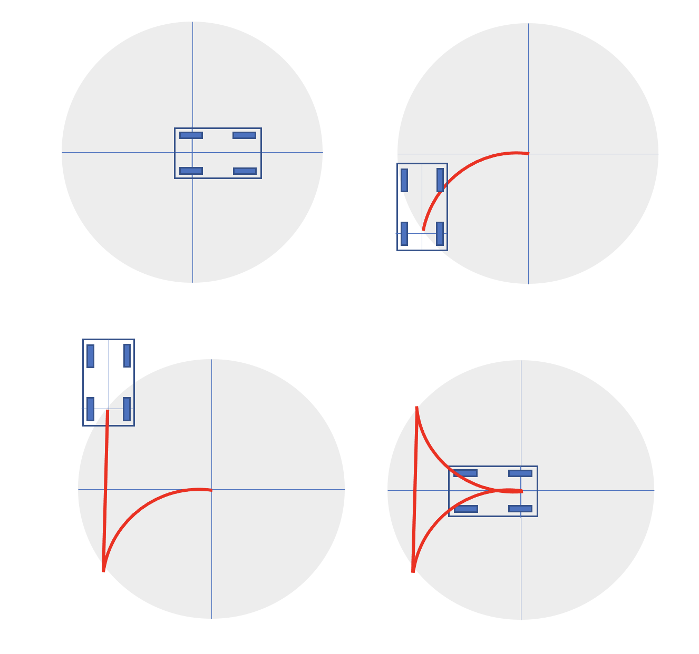

<!-- footer:  Reeds, J., & Shepp, L. (1990). Optimal paths for a car that goes both forwards and backwards. Pacific journal of mathematics, 145(2), 367-393.-->

--- 
# RRT*  (Karaman et al, 2011)

Incrementally repair **RRT**(Rapidly-exploring Random Tree). 

- RRT (Rapidly-exploring Random Tree)
  - Popular motion planner in Robotics 
- RRT* 
  - Normal RRT 
  - Choose parent node
  - Rewire 

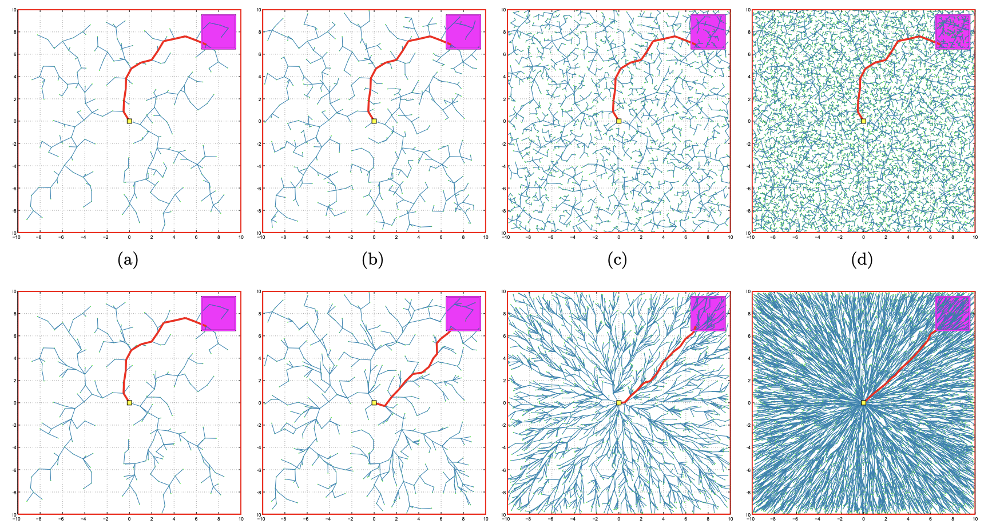

<!-- footer: Karaman, S., Walter, M. R., Perez, A., Frazzoli, E., & Teller, S. (2011, May). Anytime motion planning using the RRT. In 2011 IEEE International Conference on Robotics and Automation (pp. 1478-1483). IEEE.-->

--- 
# Motion Planning in Multiple Agent Scenarios
- *NOT "Multi-Agent Motion Planning"*
  - MAMP is NP-Hard and not studied in this project. 
- **Approach**: 
  - plan each agent individually 
  - solve conficts locally 
- **Conflict Resolution**:
  - Simple Replanning 

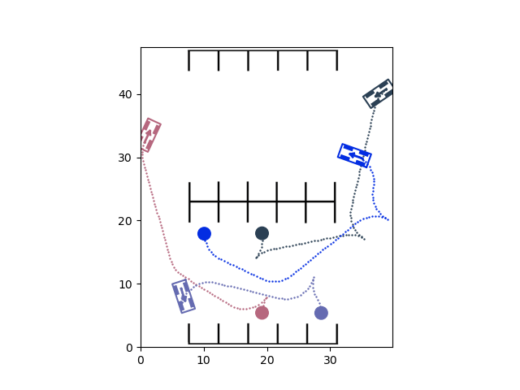

<!-- footer: . -->
--- 
# Conflict Resolution - Simple Replanning

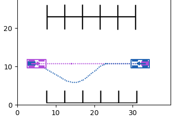

- If collision is about to occur in execution, 
  - replan one of the vehicles locally
  - other affected vehicles wait for random amount of time  
- Most of the time, conflicts occur between two vehicles. 

<!-- footer: . -->

--- 
# Simple Replanning - Limitation 
- **Not complete**!
  - solve conflicts while executing paths
  - The checked waypoints are fixed
  - Can not recover further than one-time step. 

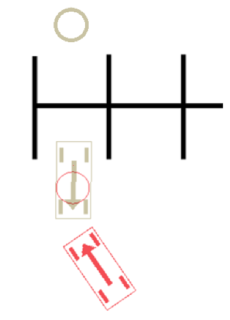

<!-- footer: . -->

--- 
<!-- _class: cover-->
# Implementation  

---
# Implementation 
## Parking Lot Environment Creator
- PNG file as the parking lot environment 
- manually label the parking spaces
- can fit any kind of parking environment 

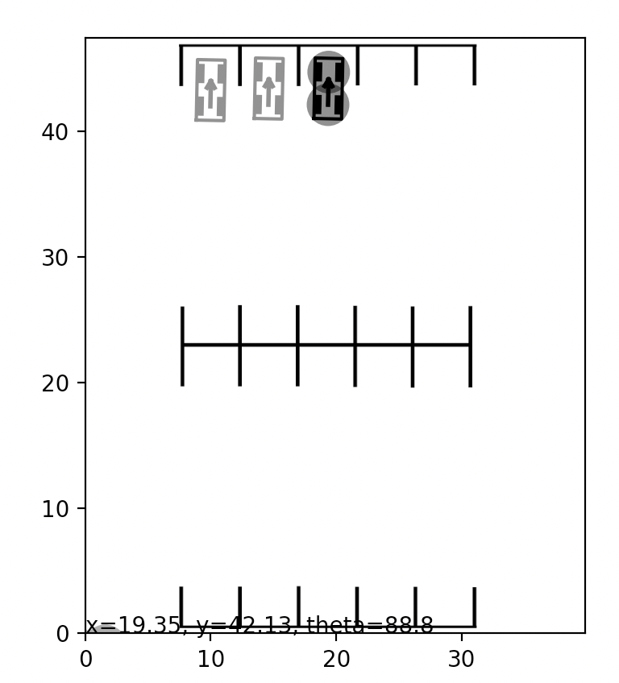

<!-- footer: . -->

--- 
# Implementation 
## Simulator Core
- implemented in C++
## Motion Planning  
- motion planning uses the library **OMPL** (Open Motion Planning Library) 
## Visualization 
- offline visualization implemented in Python 

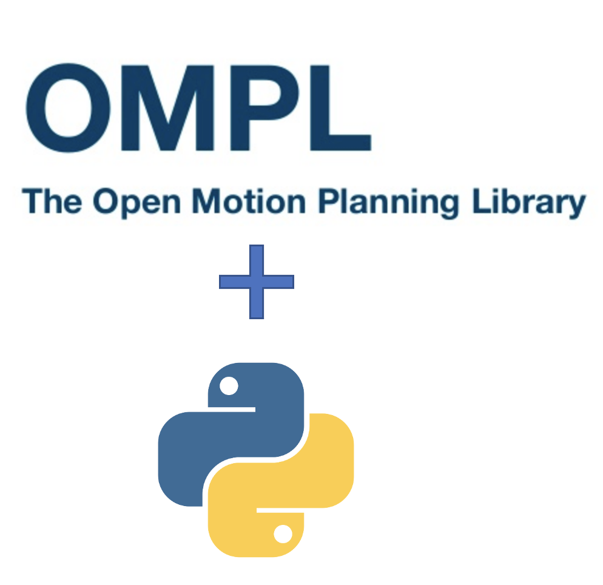

---

<!-- _class: cover-->
# Experimental Results   

---
# Experimental Results   
- Benchmark Problems
  - 1 to 5 agents 
  - 20 scenarios for each number of agent and each method. 
  - in a scenario, each vehicle starts at a random location. 
  - in total, $20 \times 5 \times 3 = 300$ scenarios.
- Evaluation 
  - success rate 
  - average path length 
  - longest path length 

<!-- footer: . -->

--- 
# Experimental Results
## Success Rate 
The probability find a set of collision-free trajectories. 

- Improvement compared to random 
  - **Greedy: 14.8 %**
  - Prioritized: 12.4 %  

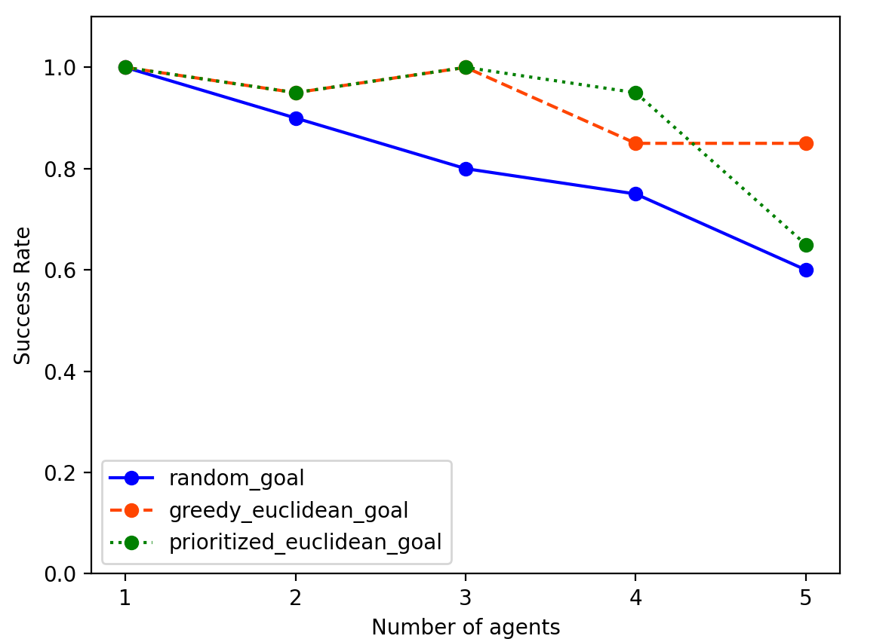  

--- 
# Experimental Results
## Average Path Length 
The average path length of successful cases.  

- Improvement compared to random 
  - Greedy: 65.4 %
  - **Prioritized**: **66.8 %**

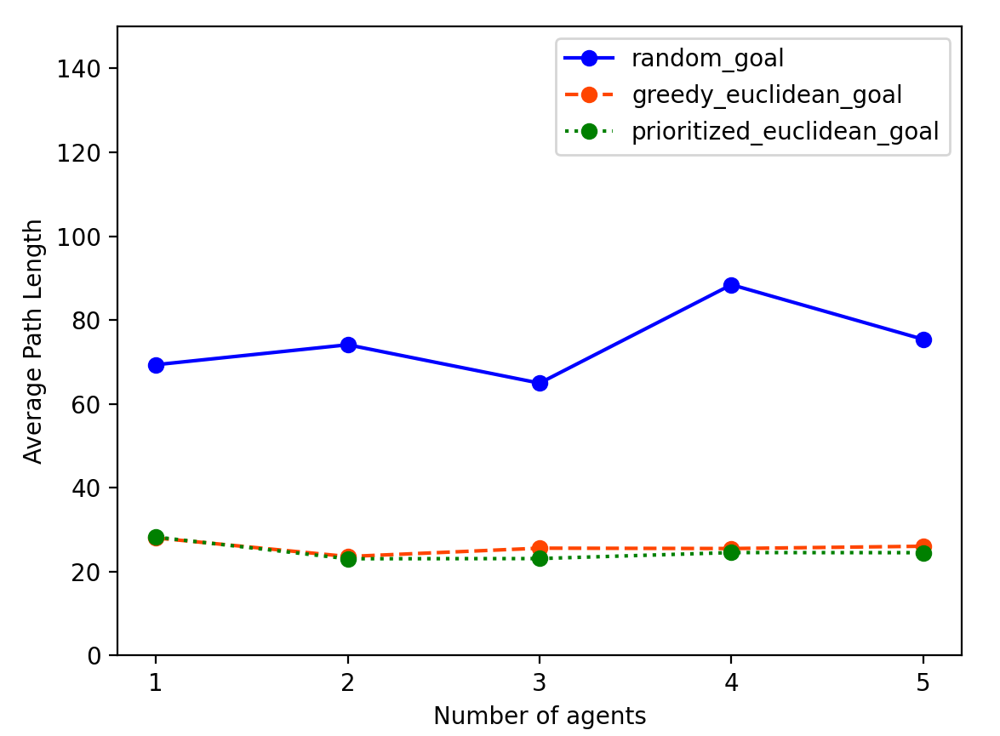 

---
# Experimental Results
## Longest Path Length 
The longest path length of successful cases.  

- Improvement compared to random 
  - Greedy: 62.8 %
  - **Prioritized: 66.6 %**

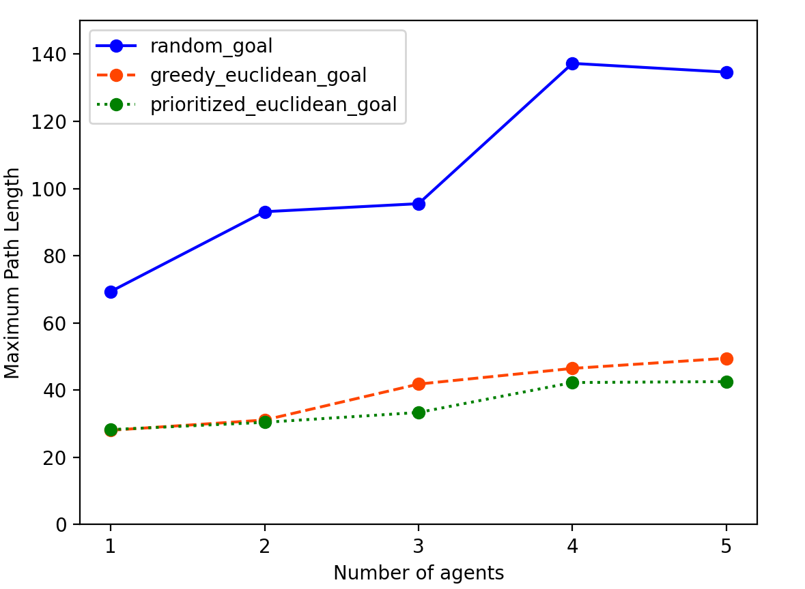 

---
# Experimental Results - Findings 
- Prioritized (brute force search) method generates shorter path, but lower success rate (potential more conflicts) 
- Greedy (best first search) method has higher success rate 

- The average/longest path length does not increase as the number of agent increasing. 
  - the occupancy rate is 0 (all parking spaces are empty). 

--- 
<!-- _class: cover-->
# Limitations 

---
# Limitations

- Not addressing **dynamic scenarios**
  - ***occupancy rate*** (some parking spaces may be occupied).
  - vehicles can ***come in*** and ***go out***. 
- Not **Multi-Agent Motion Planning** 
  -  MAMP is a well-studied topic in recent years.
  -  MAMP should improve conflict resolutions. 

<!-- footer: Mock-up Sparkman: A Smart Parking Management Tool by Okan Gurbuz et al https://c2smart.engineering.nyu.edu/2021/03/12/mock-up-sparkman-a-smart-parking-management-tool/ -->

--- 
<!-- _class: cover-->
# Future Work  

<!-- footer: . -->
---
# Future Work 
### "Closed-loop" Goal Assignment Algorithms 
- dynamically assign goals based on current availability 
- take **occupancy rate** as a concern (and more heuristic functions)
- in a frame, each vehicle can be thought of starting at a random location (we have studied). 

### Multi-agent Motion Planning 
- pre-process non-holonomic constraints by PRM (Probabilistic RoadMap) and shooting method.
- deal with MAMP (Multi-Agent Motion Planning) in query phase (moving obstacles, cooperations among agents).
- comparisons between the Greedy and Prioritized methods when a large number of agents involved.  

<!-- footer: . -->

--- 
# Future Work :: Applications 
### Traditional Parking Lot for Human Drivers
- "Closed-loop" Goal Assignment Algorithms
- motion planning provides a reference path 

### Pure Autonomous Cars
- space-time motion planning  

### Mixed-traffic : human drivers and autonomous cars 
- predict human drivers' future movement
- incorporate the predictions into the costmap. 

--- 
<!-- _class: cover-->
# Conclusion   

---
# Conclusion 

- The parking space assignment problem has not studied extensively yet. 
- This project is just the beginning of parking space assignment problem.
- Two parking space assignment algorithms were developed and evaluated
- Simple conflict resolution strategy was developed. 

<!-- footer: . -->

--- 
# Acknowledgements

Special thanks to my supervisor Akansel !
